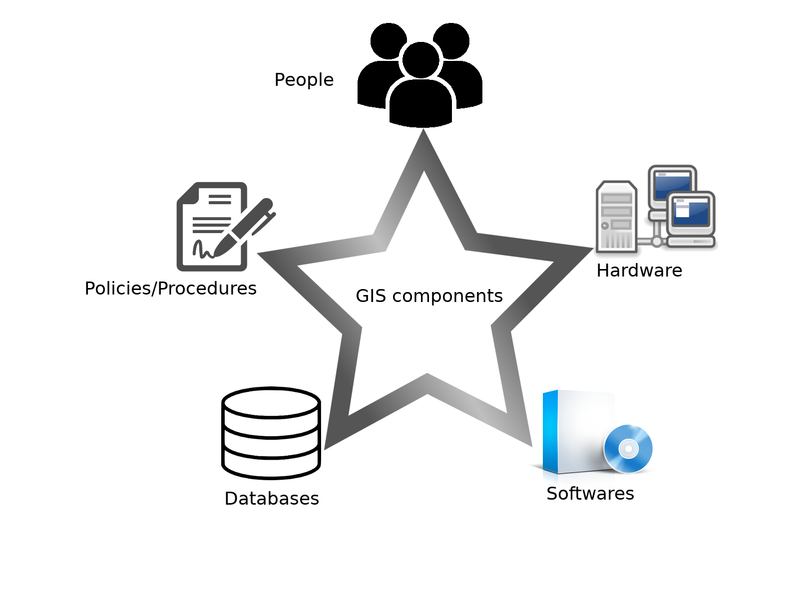

Introduction
=====

.. _Introduction:

In this chapter we aim to explain the concepts of Geoportal, its role in In this chapter, we aim to explain the concepts of Geoportal, its role in Spatial Data Infrastructure (SDI), and the overall working of Gambia EbA Geoportal.

"""""""""""""""""""""""""""""""""""""""""""""""""""""""""""""""""""""""""""""""""""""""""""""""""""""""""""""""""""""""""""""""""""""""""""""""""""""""""""""""""""""""""""""""""""""""""""

.. toctree::
   :maxdepth: 2
   :caption: Contents:

------------
Basic Concept of Geoportals
------------

.. toctree::
   :maxdepth: 2
   :caption: Contents:
   
--------------
Spatial Data Infrastructure (SDI)
--------------
Spatial Data Infrastructure (SDI) is a set of guidelines regarding the acquisition, storage, visualization, and dissemination of spatial data. The standard definition of SDI is that it is “the technology, policies, standards, human resources, and related activities necessary to acquire, process, distribute, use, maintain, and preserve spatial data”. The technology, policies, standards, human resources (sometimes also called stakeholders) and activities work together (as shown in
the image below) to give shape to SDI.

• Policies
Policies include the identification of organizations that will collect spatial data.
Types of data collection (like hydrological, demographic, etc.), who will be the
owner and who will have access to spatial data, and at what level are also part
of policies. Policies also include information regarding updating spatial data.

• Standards

Standards (regarding data) include Coordinate Reference System (CRS) which
will be used to collect spatial data at the source and for distribution, metadata and
types of final outputs that will be distributed.

More details regarding SDI can be found at the “United Nation Geographic
Information Work Group (UNGIWG)” website http://www.ungiwg.org.

.. toctree::
   :maxdepth: 2
   :caption: Contents:

------------
Introduction to Gambia EbA Geoportal.
------------

Now that we have a brief understanding of what a Geoportal is and what it
comprises, we can now have a look at the Gambia EbA Geoportal. We will
start by looking at the User Interface and get a feel of it as we navigate through
its various functionalities.
The main method of interacting with Geoportal is through the web interface.
The interface is very interactive and allows viewing, modification, and shearing
of existing spatial Layers and Maps.
To access the Gambia Geoportal we use the following URL: ec2-3-23-95-
209.us-east-2.compute.amazonaws.com. The first thing we see when the
portal loads is the Home/Welcome page as demonstrated by the figure below;
To access/view the above page one does not have to be an existing user and hence
one can only view the general content, to interact with the Geoportal
better one needs to log in or create an account (if not created yet). The account
creation process will be explained at a later stage in this document.
The Home page provides a variety of options even without registering. At
At the top of the page, we have a Navigation bar showing quick links to view
Data(layers and Documents), Maps, About and Groups pages. To the far right
of the navigation bar, we have a search field, and further to the right we have a
Registration and Sign sections are to be selected appropriately depending on the user
registration status with the Gambia Geoportal.
When one clicks on a given module they will be directed to the specific module
section in the Gambia Geoportal. A brief abstract of the core modules is as
follows

• The Usermodule: This covers creating a user account, types of users,
managing users account, user groups and access privileges.

• The Layers module: This gives a list of uploaded layers, an upload section
to add new layers, editing a layers metadata and style, commenting, rating
and sharing a layer.

• The Documents Module: This module handles all documents of the fol-
lowing file types; .doc, .docx, .gif, .jpg, .jpeg, .ods, .odt, .odp, .pdf, .png,
.ppt, .pptx, .rar, .sld, .tif, .tiff, .txt, .xls, .xlsx, .xml, .zip, .gz to .qml.
This module allows one to upload and share non-spatial data with other
stakeholders.

• The Maps module: This allows one to view a list of already created Maps,
creat a new Map, Edit a Map as well as style a Map.

• Administration Module: This explains additional privileges of a Super
user. The Administrator module also covers managing the GeoServer.

.. autosummary::
   :toctree: generated

   lumache
